# NOC Router - Visual Architecture Diagrams

## 1. Module Hierarchy

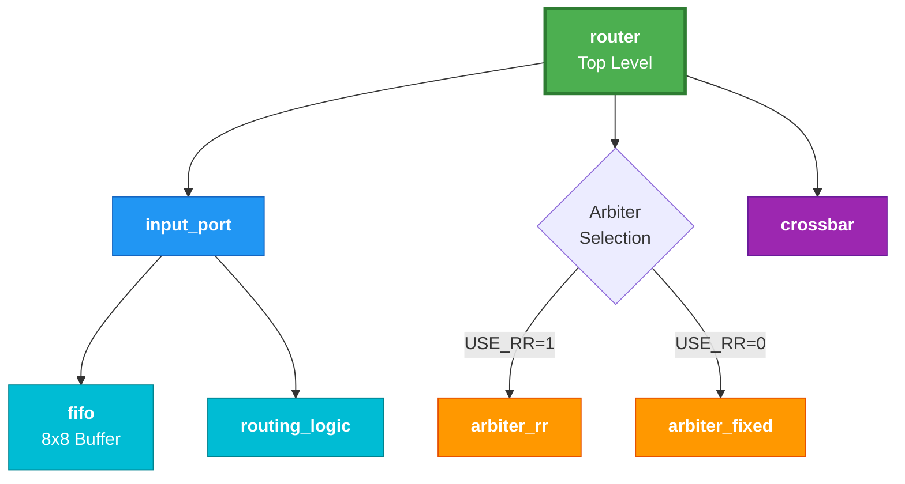

---

## 2. Data Path Flow

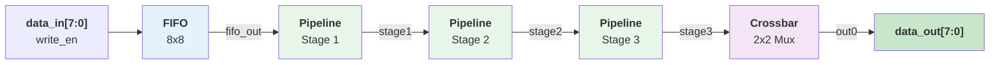

---

## 3. Control/Routing Path

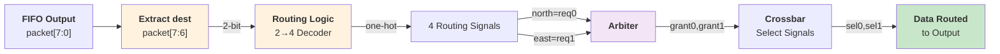

---

## 4. Routing Logic Truth Table

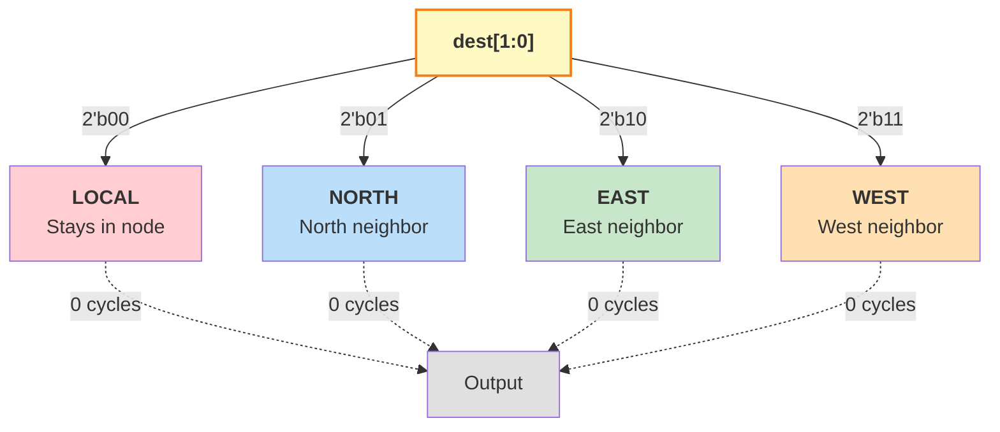

---

## 5. Arbiter Comparison

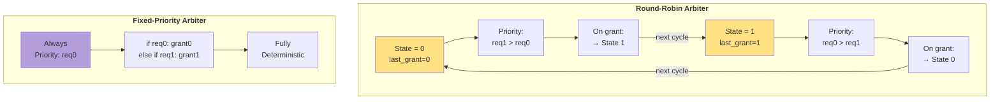

---

## 6. FIFO Internal Structure

```mermaid
graph TD
    A["<b>Write Input</b><br/>data_in[7:0]"] --> B["<b>Memory Array</b><br/>reg[7:0] mem[0:7]"]
    C["<b>Write Pointer</b><br/>3-bit WP"] -->|mem[WP]| B
    D["<b>Read Pointer</b><br/>3-bit RP"] -->|mem[RP]| B
    B --> E["<b>Read Output</b><br/>data_out[7:0]"]
    
    F["<b>Entry Counter</b><br/>4-bit count"] -->|logic| G["full = count==8"]
    F -->|logic| H["empty = count==0"]
    
    style B fill:#E3F2FD,stroke:#1976D2,stroke-width:2px
    style C fill:#FFF3E0
    style D fill:#FFF3E0
    style F fill:#E8F5E9
    style G fill:#FFCDD2
    style H fill:#FFCDD2
```

---

## 7. Pipeline Stages Timeline

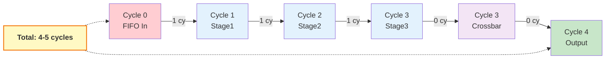

---

## 8. Crossbar Switch Function

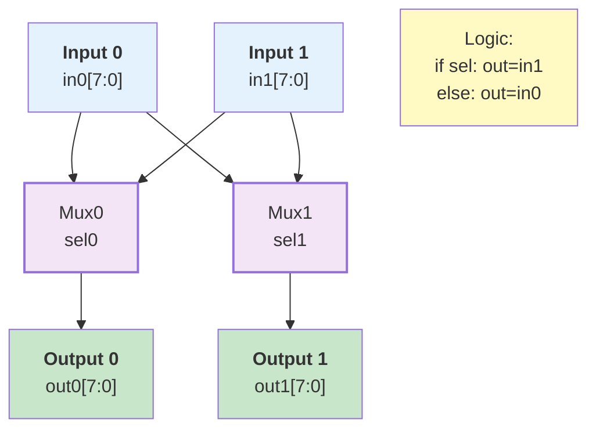

---

## 9. Packet Format Breakdown

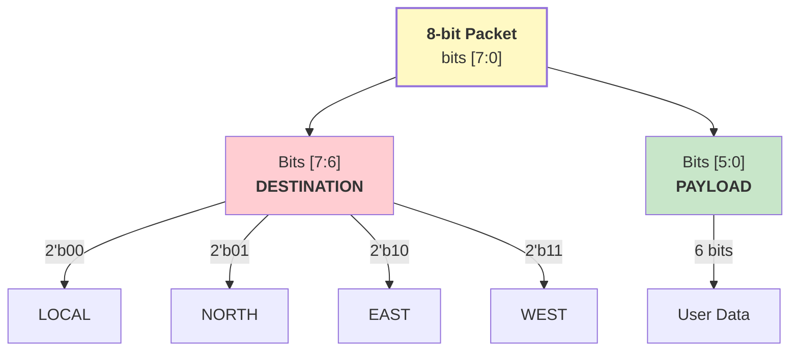

---

## 10. Complete Data Flow Sequence

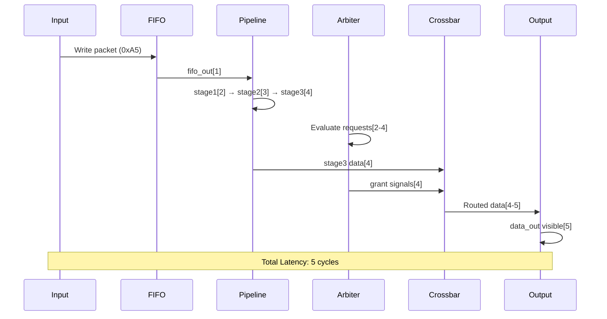

---

## 11. Clock and Reset Timing

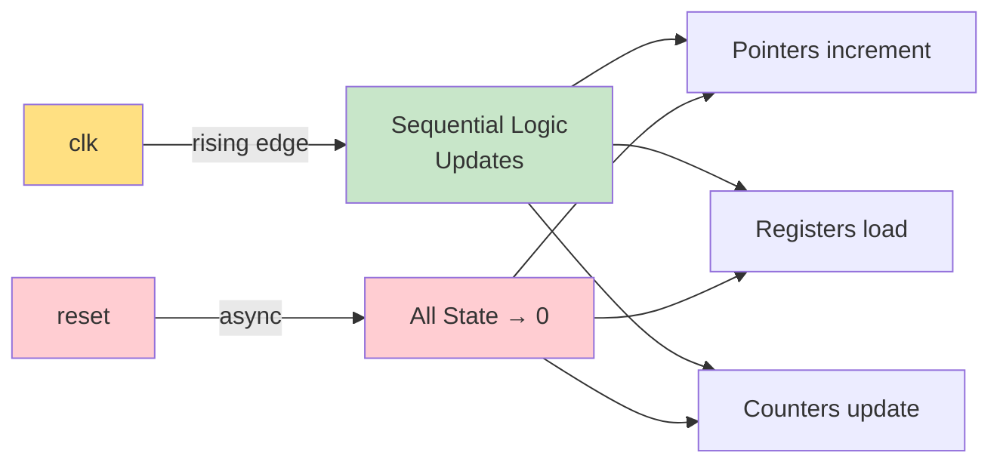

---

## 12. Area and Latency Trade-off

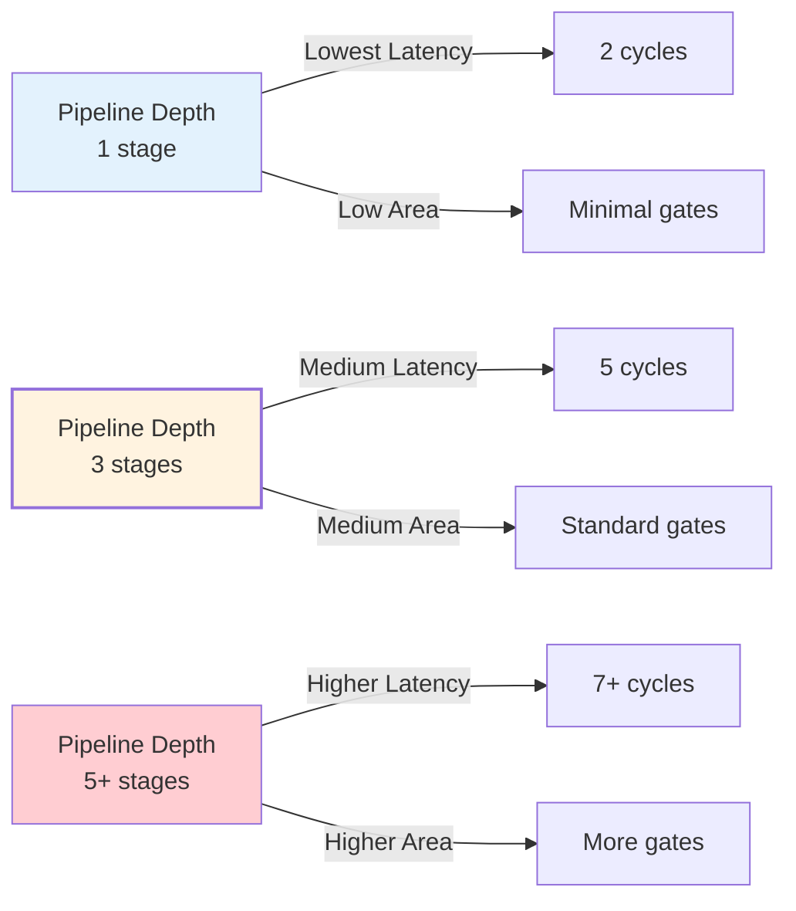

---

## Key Metrics Summary

| Metric | Value | Notes |
|--------|-------|-------|
| **Data Width** | 8 bits | Fixed |
| **FIFO Depth** | 8 entries | 3-bit pointers |
| **Pipeline Stages** | 3 | Configurable |
| **Latency** | 5 cycles | FIFO+3 stages+CB |
| **Throughput** | 1 pkt/cycle | 800 Mbps @ 100 MHz |
| **Area (RR)** | ~700 gates | Approximate |
| **Area (Fixed)** | ~550 gates | Approximate |
| **Arbiters** | 2 types | Both provided |

